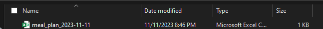
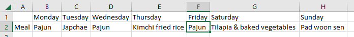
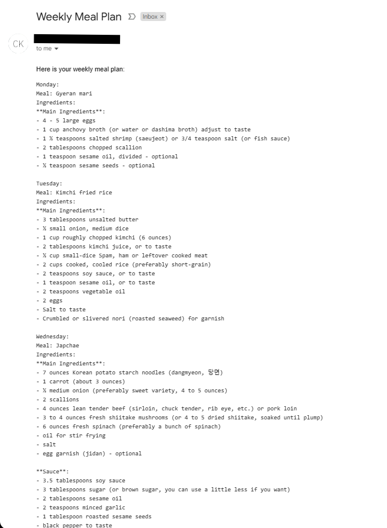
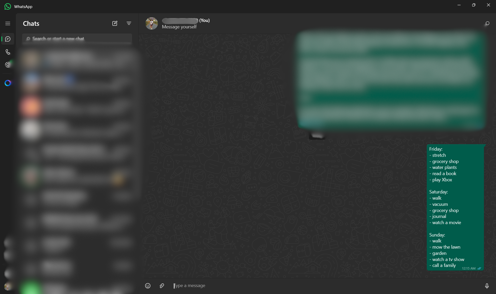
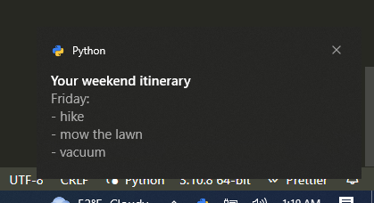

# DecisionParalysis

## Meal Planner
  
This Python script generates a meal plan for the week by randomly selecting a meal option for each day of the week. The meal options and days are defined in the code using Python lists. The program uses the pandas library to convert the generated meal plan into a DataFrame and save it as a CSV file with the current date in the filename. Finally, the program prints a message confirming that the meal plan has been exported.

Save as csv file with timestamp:

See the plan in the csv file:

Alternatively you can get the meal plan straight to your inbox _along with the ingredients to eliminate the task of creating a shopping list_.

__Requirements__
  
- Python Python 3.11.8
  
__Customization__
  
You can modify the meal options or add new ones as per your preference. Just edit the `meal_option` list in the script to include your desired activities.  

  
## Weekend Planner
  
This Python script generates a weekend itinerary consisting of activities for Friday, Saturday, and Sunday. The activities are categorized into exercise, chore, and leisure. The script randomly selects one exercise activity, two chore activities, and two leisure activities for each day and combines them into a full itinerary.  

You can get that either in your windows notification center as a pop up...

or get a text message or an email.

__Requirements__ 
  
- Python Python 3.11.8
- `win10toast==0.9`
- `pywhatkit==5.4`
  
__Customization__
  
You can modify the activities or add new ones as per your preference. Just edit the `exercise`, `chore`, and `leisure` lists in the script to include your desired activities.  
  

