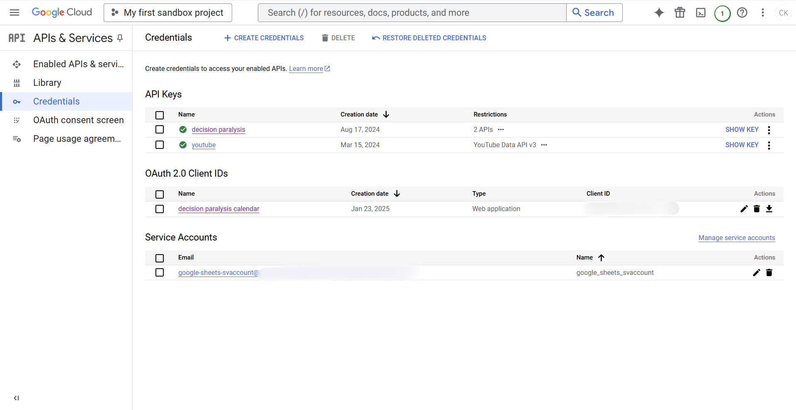

# DecisionParalysis

## API configuration
  
This app uses google APIs and OAuth to send emails and add events to google calendars.
The  documenation is provided by Google. Follow their documentation to set up the project environment, install the client library, and configure the python file with their provided smaple code. Once everything is set up, this is how your google console should look.

## Storing credentials with Github
